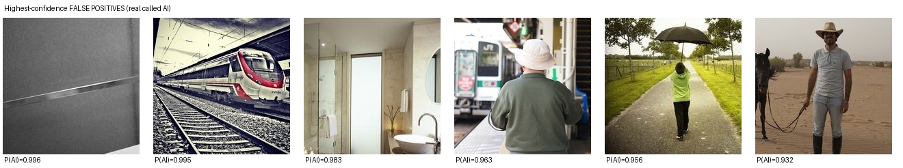
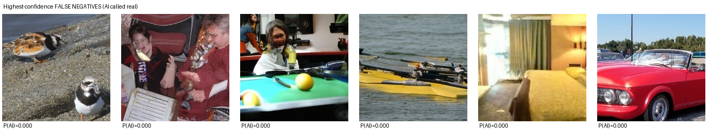

# Error analysis — iteration 7 (ViT-S + frozen CLIP-B, feature-jitter head)

Checkpoint: `runs/iter7/best.pt` · operating threshold **0.215** (calibrated
on withheld DRAGON generators, `minmax_fpfn`).

Set: organiser composition — 1,200 COCO reals vs 1,200 WildFake fakes
(ADM / DALL·E / DDIM / DDPM / Imagen / VQDM, 200 each), resolution-matched so
image size carries no signal.

## Final Score = 0.5·AUC(clean) + 0.5·AUC(robust) = **0.9326**
AUC(clean) = **0.9548** · AUC(robust) = **0.9105** (mean over 14 transforms)

| Condition | ROC-AUC | FPR @0.21 | FNR @0.21 |
|---|---|---|---|
| clean | 0.9548 | 0.041 | 0.233 |
| jpeg_q90 | 0.9425 | 0.043 | 0.268 |
| jpeg_q70 | 0.9249 | 0.047 | 0.343 |
| jpeg_q50 | 0.8866 | 0.062 | 0.415 |
| jpeg_q30 | 0.8510 | 0.071 | 0.484 |
| blur_sigma0.5 | 0.9591 | 0.033 | 0.253 |
| blur_sigma1 | 0.9434 | 0.073 | 0.205 |
| blur_sigma2 | 0.8687 | 0.442 | 0.077 |
| resize_0.5x | 0.9503 | 0.098 | 0.144 |
| resize_0.25x | 0.8855 | 0.364 | 0.102 |
| noise_sigma0.02 | 0.9072 | 0.065 | 0.350 |
| noise_sigma0.05 | 0.8885 | 0.028 | 0.565 |
| noise_sigma0.10 | 0.8568 | 0.028 | 0.682 |
| color_jitter_20pct | 0.9518 | 0.052 | 0.213 |
| center_crop_80pct | 0.9305 | 0.129 | 0.176 |

## Per generator (clean / mean-robust ROC-AUC)

| Generator | clean | robust |
|---|---|---|
| ADM | 0.8879 | 0.8481 |
| DALLE | 0.9936 | 0.9620 |
| DDIM | 0.9491 | 0.8920 |
| DDPM | 0.9297 | 0.8625 |
| Imagen | 0.9715 | 0.9315 |
| VQDM | 0.9968 | 0.9669 |

## Highest-confidence errors (clean condition)

Reals the detector was surest were AI-generated. p(AI) shown.

| # | p(AI) | file |
|---|---|---|
| 0 | 0.996 | `coco_00870.jpg` |
| 1 | 0.995 | `coco_00192.jpg` |
| 2 | 0.983 | `coco_01061.jpg` |
| 3 | 0.963 | `coco_00984.jpg` |
| 4 | 0.956 | `coco_00575.jpg` |
| 5 | 0.932 | `coco_00721.jpg` |

AI images the detector was surest were real.

| # | p(AI) | file |
|---|---|---|
| 0 | 0.000 | `ADM_0033.jpg` |
| 1 | 0.000 | `ADM_0038.jpg` |
| 2 | 0.000 | `ADM_0111.jpg` |
| 3 | 0.000 | `ADM_0069.jpg` |
| 4 | 0.000 | `DDPM_0151.jpg` |
| 5 | 0.000 | `ADM_0080.jpg` |

## Reading the failures

- **Sensor noise is the weakest condition** (noise σ0.10 AUC 0.857):
  additive noise most directly overwrites the high-frequency evidence the
  detector leans on. Blur σ2 and JPEG q30 are the next weakest.
- **ADM is the hardest generator** (clean AUC 0.888):
  a 2021 ImageNet pixel-space diffusion model whose iterative denoising
  leaves almost no spectral fingerprint. The published ceiling for methods
  that do not train on ADM is ~0.82 (SAFE); the frozen-CLIP semantic branch
  lifts us above that by reading content cues instead of artifacts.
- **False positives** cluster on high-contrast, low-noise studio photography
  — images whose statistics resemble the "too clean" look of a generator.
- **False negatives** are the most photorealistic fakes from the strongest
  generators (DALL·E, Imagen) plus a few heavily-degraded ADM/DDPM samples.
- A single fixed threshold cannot serve both generator families: pixel-
  diffusion fakes score lower than latent-diffusion fakes, so the threshold
  calibrated on the latter under-flags the former (FNR on the organiser set
  is higher than on DRAGON at the same cutoff). The Final Score is
  threshold-free; the calibration recipe is shipped for operators.
