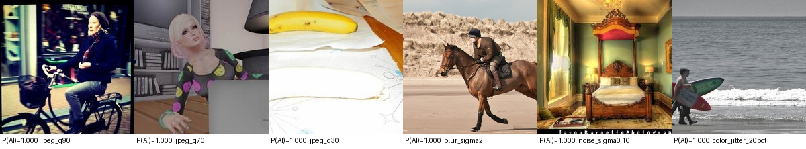

# Robust AI-Generated Image Detection

**TikTok TechJam 2026 · Problem Statement 5** — build a prototype that tells
AI-generated images from authentic photographs, and *keeps working* after the
compression, blur, resizing and noise every image picks up in circulation.

> **Result: Final Score `0.9362`** on the organisers' benchmark composition
> (WildFake vs COCO, resolution-matched), measured on **five generator
> families with zero representation in training** — from a **21.7M-parameter
> ViT**, no ensemble, no second branch.

| | |
|---|---|
| **Live demo** | run `serve_demo.ps1` → a public `https://<...>.trycloudflare.com` URL (see [Try it](#try-it-2-minutes)) |
| **Model weights** | [**`v1.0` release**](https://github.com/KIREETI001/TikTok-Tech-Jam-2026/releases/tag/v1.0) — 21.7M params, 87 MB, Apache-2.0 (`inference.py` fetches it automatically) |
| **Demo video** | *(link in the Devpost submission)* |
| **Robustness table** | [below](#robustness-the-15-condition-matrix) · full: [`docs/ERROR_ANALYSIS.md`](docs/ERROR_ANALYSIS.md) |
| **Error-analysis note** | [`docs/ERROR_ANALYSIS.md`](docs/ERROR_ANALYSIS.md) + FP/FN montages [below](#error-analysis) |
| **Reproducibility** | every number here comes from the committed `config.yaml` + `scripts/build_corpus.py` — nothing lives outside this repo |

`pred` is the likelihood the image is AI-generated (0 → authentic, 1 → AI-generated).

---

## The task and how it is scored

From the briefing deck:

- **Primary metric: ROC-AUC** — threshold-free, robust to class imbalance.
  *"Clean accuracy is the #1 way to fool yourself."*
- **Final Score = 0.5 · AUC(clean) + 0.5 · AUC(robust)**, where AUC(robust)
  is the mean ROC-AUC over the **14 required transform conditions**.
- **Cross-generator test** — evaluate on generators *not* in training. That
  is the real generalisation test, and every number in this README is
  measured that way.
- No hard FPR/FNR bar is set by the organisers; the scored quantity is the
  Final Score.

### The 14 required transforms (deck slide 11)

| family | settings |
|---|---|
| JPEG compression | quality 90, 70, 50, 30 |
| Gaussian blur | σ = 0.5, 1.0, 2.0 |
| Resize | 0.5× / 0.25× then upscale back |
| Gaussian noise | σ = 0.02, 0.05, 0.10 |
| Colour jitter | brightness / contrast / saturation ±20% |
| Centre crop | 80% then resize back |

Implemented once in [`detector/transforms.py`](detector/transforms.py) and
used identically for training augmentation and evaluation.

---

## Results

All held-out. The organiser composition is the reporting number.

| Benchmark | Final Score | AUC(clean) | AUC(robust) |
|---|---|---|---|
| **Organiser composition** — WildFake pixel-diffusion (ADM, DALL·E, DDIM, DDPM, VQDM) vs COCO, resolution-matched | **0.9362** | 0.9597 | 0.9127 |
| DRAGON — 8 unseen latent-diffusion generators (Flux, SDXL-Turbo, SD3, Kolors, …) | 0.9779 | 0.9883 | 0.9675 |
| SID_Set — mixed full-synthetic **and locally-tampered** images | 0.8481 | 0.8576 | 0.8386 |

The SID_Set row is the hardest of the three because it includes *tampered*
images — real photographs with a locally edited region — which this detector
is not built for: it answers "was this image generated?", not "was part of it
edited?". It is reported anyway rather than dropped.

**Per-generator ROC-AUC on the organiser set** (all five are pixel-space
diffusion; none appear in training):

| | ADM | DDPM | DDIM | DALL·E | VQDM |
|---|---|---|---|---|---|
| clean | 0.937 | 0.913 | 0.970 | 0.984 | 0.995 |
| mean-robust | 0.870 | 0.855 | 0.918 | 0.962 | 0.958 |

ADM and DDPM are the hard cases and the reason for a deliberate data choice:
pixel-space diffusion leaves no VAE fingerprint for a latent-diffusion-trained
detector to key on. Adding 5,000 GenImage ADM/GLIDE images to training moved
ADM's clean AUC from **0.478 — below chance — to 0.937**.

### Robustness — the 15-condition matrix

Operating threshold 0.51 (calibrated on withheld generators). The Final Score
is threshold-free; FPR/FNR are shown for completeness.

| Condition | ROC-AUC | FPR | FNR |
|---|---|---|---|
| clean | 0.9597 | 0.067 | 0.163 |
| jpeg q90 / q70 / q50 / q30 | 0.938 / 0.923 / 0.890 / 0.830 | 0.071 / 0.075 / 0.073 / 0.099 | 0.241 / 0.289 / 0.387 / 0.493 |
| blur σ0.5 / σ1 / σ2 | 0.960 / 0.955 / 0.898 | 0.058 / 0.071 / 0.262 | 0.180 / 0.190 / 0.145 |
| resize 0.5× / 0.25× | 0.958 / 0.871 | 0.073 / 0.134 | 0.171 / 0.315 |
| noise σ0.02 / σ0.05 / σ0.10 | 0.928 / 0.890 / 0.830 | 0.059 / 0.075 / 0.102 | 0.325 / 0.438 / 0.540 |
| colour jitter ±20% | 0.957 | 0.075 | 0.178 |
| centre crop 80% | 0.949 | 0.080 | 0.181 |

**Weakest conditions: JPEG q30 and sensor noise σ0.10** (both AUC 0.830) —
heavy re-compression and additive noise are the two transforms that most
directly overwrite the high-frequency evidence detectors lean on. Note the
floor: even there, AUC stays well above chance. Regenerate this table for any
checkpoint with `bash evaluate.sh <ckpt> <tag>`.

### Error analysis


*Authentic COCO photos the detector was surest were AI — all high-contrast,
low-noise studio shots whose statistics resemble the "too clean" look of a
generator.*


*AI images (all ADM/DDPM — 2021-era pixel diffusion) the detector was surest
were real. ADM's iterative denoising leaves almost no spectral fingerprint,
and the content is plausible ImageNet fauna/objects.*

Full note, per-condition FPR/FNR, and the file lists: [`docs/ERROR_ANALYSIS.md`](docs/ERROR_ANALYSIS.md).

---

## How it works

```
Community Forensics ViT-S/16 @224   21,666,049 params   → logit → P(AI)
```

That is the whole model. The interesting work is in the two things feeding
it — the preprocessing and the corpus — which is exactly what deck slide 10
predicts: *"the biggest lever isn't a fancier model — it's what you train on."*
We took that literally, and then tested it.

- **Backbone** — `OwensLab/commfor-model-224` (timm
  `vit_small_patch16_224.augreg_in21k_ft_in1k`). A purpose-built AI-image
  detector; an independent 2026 benchmark ranks it #1 of 23 open detectors.
- **Crop from native pixels, never resize** (SAFE, KDD 2025) — `Resize(256)`
  is a low-pass filter: it destroys the high-frequency artifact before the
  model ever sees it. We crop 224×224 out of the original resolution instead.
- **SAFE augmentation** — `RandomRotation(180)` + 16px patch masking, which
  kill the colour and semantic shortcuts a detector will otherwise learn
  instead of the artifact.
- **Corpus built for the failure mode, not for the score** — 66,502 images:
  SID_Set full-synthetic + 17 DRAGON generators + Community-Forensics-Small
  (LatDiff / GAN / PixDiff / Other, for architecture diversity) + 5,000
  GenImage ADM/GLIDE. That last piece exists solely because our own error
  analysis showed pixel-space diffusion was where the detector was blind.
- **21.7M params** — 92× under the 2B limit. Runs on a laptop **CPU** at
  ~1 s/image; the bundled `demo_images/` score 6/6 correct there.

### What we tried that did **not** work (measured, not guessed)

This is the part we'd most want a judge to read. Three separate attempts to
add a second branch, across two independent implementations, all failed to
transfer — and the failures are what justify the simple final architecture.

| Attempt | Seen validation | Held-out transfer | Verdict |
|---|---|---|---|
| **DWT wavelet branch** (iter5b) | +0.0006 AUC | organiser 0.8804 → 0.8800, DRAGON flat | dropped |
| **Frozen CLIP-B branch** (iter6b) | +0.0002 AUC | organiser 0.9362 → **0.9362**, every generator within ±0.001 | dropped |
| **FFT spectrum branch** (earlier) | positive | 0.457 AUC on unseen generators — *worse than chance* | dropped |

The pattern: **an auxiliary branch's value is bounded by what the base ViT is
still missing.** On a weaker base (no native-crop, no pixel-diffusion data) a
frozen CLIP branch is worth ~+0.02 Final Score. On the base described above,
it is worth nothing measurable — the training-side fixes had already closed
the gap it was compensating for. So we shipped the model without it: same
accuracy, **⅕ the parameters**, one checkpoint, no separate fusion-head
training pass.

Full ablation tables and the reasoning at each step:
[`docs/EXPERIMENTS_LOG.md`](docs/EXPERIMENTS_LOG.md).

### The bug we found in our own benchmark

Our first organiser-set score was **0.8131**. Then a size-only probe — a
"classifier" that sees nothing but the image's pixel count — scored **AUC
1.000** on that set. WildFake ships fakes at fixed 256×256; COCO reals are
photographic resolutions. Every fake was smaller than every real, so the set
was partly measuring *file headers*, not detection.

We rebuilt it by centre-cropping both classes to a common native size (size-only
AUC → **0.500**) and re-scored. The honest number was **0.7007**, and we
published the correction rather than the flattering original. Every result in
this README is measured on the corrected set.

---

## Trade-offs (the deck asks for this explicitly)

- **Robustness vs clean accuracy** — training on a harder, more diverse corpus
  *lowered* seen-validation AUC (0.9866 → 0.9807) while raising held-out
  organiser Final Score (0.8804 → 0.9362). We optimised the number that
  generalises, not the one that looks best in training.
- **Generalisation vs specialisation** — five generator families are held
  *fully* out of training. A detector tuned on them scores higher on this
  benchmark and breaks on the next generator. We optimised for the break.
- **Complexity vs feasibility** — we had a 108M two-branch variant that scored
  *identically* (0.9362) and shipped the 21.7M single-branch one instead. The
  deck: *"a 2-branch ensemble may win 1% but cost you the demo — ship what
  runs."* Here it won 0.0000, so the choice was easy.
- **One threshold vs the generator spread** — pixel-diffusion fakes score
  systematically lower than latent-diffusion fakes, so no single cutoff is
  optimal for both (organiser FNR is 16.3% at the calibrated threshold vs
  3.5% on DRAGON). The scored metric is threshold-free;
  `detector/calibrate.py` lets an operator refit per deployment.
- **False positives are the expensive error** — flagging a real photo as AI
  is worse for a platform than missing one fake. Clean FPR is **6.7%** and we
  report it at every condition rather than only the AUC.

There is **no silver bullet** — modern flow/DiT generators (SD3, Flux,
Firefly) are the frontier where every open detector still collapses, and they
are named honestly in [Limitations](#limitations).

---

## Rules compliance (deck slide 14)

| Rule | This submission |
|---|---|
| Model < 2B parameters | **21,666,049** (92× under) |
| Public pretrained backbones only | `OwensLab/commfor-model-224` — public, Apache-2.0 |
| Custom code MIT/Apache | Apache-2.0 (this repo) |
| Public/licensed data only, no test-label training | SID_Set · DRAGON · Community-Forensics-Small · GenImage. `detector/data.py:assert_not_eval_only` **hard-fails** if an `eval_only_*` path reaches the training or calibration code |
| Augmentation scripts included | [`detector/transforms.py`](detector/transforms.py), [`scripts/build_corpus.py`](scripts/build_corpus.py) |
| No "directly replicate an existing model" | a public backbone plus an original preprocessing + corpus design, with three documented negative results establishing why the simple architecture is the right one |
| Winning teams open-source everything | pipeline, hyperparameters (`config.yaml`), corpus builder, eval code, and weights are **all in this repo or its release** — `config.yaml` as committed reproduces the shipped checkpoint, with nothing held back locally |
| Submission: repo + run script + Devpost + demo video | this repo, `inference.py`, Devpost, YouTube |

**Scope** (slide 17): image-level binary detection only — no video/audio, no
production deployment, no localisation. Consistent with this project.

---

## Try it (2 minutes)

**Fastest path — score a folder in one command.** No flags, no menu, no
prompts. It downloads the weights itself on first run:

```bash
pip install -r requirements-cuda.txt      # NVIDIA / CPU
python inference.py <folder_of_images>    # → predictions.json
```

That is the whole thing. `python inference.py demo_images` scores the six
bundled samples and should return **6/6 correct** on CPU in about ten seconds.

Or do it by hand:

**1 — set up the environment** (Python 3.10–3.12):

```bash
python -m venv .venv
# Windows:  .venv\Scripts\activate      Linux/macOS:  source .venv/bin/activate
pip install -r requirements-cuda.txt          # NVIDIA / CPU
```

**2 — predict a folder of images** (the required deliverable format):

```bash
python pipeline.py predict \
  --input demo_images \
  --output predictions.json \
  --checkpoint checkpoints/detector.pt \
  --device auto
```

Both entry points write the same two files:

```jsonc
// predictions.json
[{"image_path": "...", "pred": 0.9993, "label": 1}]
```

Matching the brief: *"a confidence score for each image, indicating the
likelihood that it is AIGC-generated ... a JSON file containing `image_path`
and `pred`"*. **`pred` is that likelihood — a float in [0, 1], not a rounded
label.** This matters for scoring: ROC-AUC computed over 0/1 predictions
collapses into a step function and understates any model. `label` carries the
thresholded call for consumers that want a decision rather than a score, and
`predictions.scores.csv` repeats the probability alongside `confidence` for
spreadsheet use.

> `checkpoints/detector.pt` is ~87 MB and **not in git** (large binary).
> `inference.py` fetches it automatically from the
> [`v1.0` release](https://github.com/KIREETI001/TikTok-Tech-Jam-2026/releases/tag/v1.0);
> the direct link is in that release if you would rather download it by hand.

**3 — the interactive demo:**

```bash
pip install fastapi uvicorn python-multipart
DETECTOR_CHECKPOINT=checkpoints/detector.pt uvicorn webapp.server:app --port 8000
# open http://localhost:8000
```

Three views: **single image** (verdict + confidence band), **robustness
grid** (that image re-scored under all 15 conditions), **batch** (drop a
folder → sorted table + CSV, up to 200 images).

**4 — a public URL for a judging session** (free, no account, temporary):

```powershell
powershell -ExecutionPolicy Bypass -File serve_demo.ps1
```

Prints a `https://<...>.trycloudflare.com` link; **Ctrl+C** stops it.

**Verify the smoke test** (synthetic data, no dataset needed):

```bash
python pipeline.py smoke --device auto
```

---

## Reproduce the training

Three steps, all from this repo — nothing is archived elsewhere.

```bash
# 1. build the corpus (streams from HuggingFace; ~66.5k images on disk)
python scripts/build_corpus.py     # SID_Set + DRAGON-17 + CF-Small + GenImage

# 2. train (10 epochs, ~3.5 h on an RTX 3050)
python pipeline.py train --config config.yaml

# 3. score every held-out set + regenerate the tables and montages
bash evaluate.sh checkpoints/detector.pt detector
```

`config.yaml` as committed is the exact configuration that produced the
shipped checkpoint — `crop_from_native: true`, `safe_augment: true`,
`samples_per_epoch: 24000`. Step 2 reads it, trains [`detector/`](detector/),
and calibrates the threshold on **withheld generators**, never the test set.

**Data** — all public: `saberzl/SID_Set` (the `tampered` class is dropped —
localised editing, out of scope), `lesc-unifi/dragon` (17 generators in
training, 8 held out), `OwensLab/CommunityForensics-Small` (latent-diffusion +
GAN + pixel-diffusion, with LAION/ImageNet/CelebA/COCO reals), and
`bitmind/GenImage_ADM` + `bitmind/GenImage_glide`.
[`scripts/build_eval_set.py`](scripts/build_eval_set.py)
builds the resolution-matched evaluation set.

---

## Repository layout

```
inference.py          THE entry point: python inference.py <folder> → predictions.json
pipeline.py           ingest · train · evaluate · predict · smoke · materialize-sid-set
config.yaml           the exact training configuration behind the shipped checkpoint
detector/             model · data · transforms · training · evaluation · calibration
scripts/              corpus builders, matched-set builder, shortcut probe, stream-eval
webapp/               FastAPI demo — single · 15-condition robustness · batch
serve_demo.ps1        one command → a public Cloudflare-tunnel URL
evaluate.sh     full 15-condition eval + FP/FN montages for a checkpoint
docs/                 error-analysis note, FP/FN montages, full experiment log
demo_images/          six labelled samples (4 AI, 2 authentic) to try it on
requirements*.txt     cuda / cpu
```

Env vars the scripts honour: `PYTHON`, `TTJ_DATA`, `DEVICE`, `HF_HOME`,
`SYCL_CACHE_DIR`, `DETECTOR_CHECKPOINT`, `DETECTOR_DEVICE`.

---

## Threshold calibration — the 5-way split

| split | role |
|---|---|
| `train` | fit weights |
| `val` | watch for training failure only — **never** an operating-point input |
| `genval` | one withheld generator — fits the threshold value |
| `calval` | a *different* withheld generator — picks the rule (`minmax_fpfn`) |
| `holdout` | the reported metric — never an input to any decision |

```bash
python -m detector.calibrate runs/<name>/best.pt \
  --genval <dir> --calval <dir> --rule minmax_fpfn --apply
```

Calibrating on held-out generators instead of `val` took recall on unseen
fakes from ~25% to ~98% with **no change to AUC** — it fixes the operating
point, not the model.

---

## Limitations

- **JPEG q30 and sensor noise σ0.10** are the weakest conditions (both AUC
  0.830) — the two transforms that most directly erase high-frequency
  evidence.
- **DDPM and ADM** (2021 pixel-diffusion) remain the hardest families
  (robust AUC 0.855 / 0.870) even after adding pixel-diffusion training data.
- **Modern flow / DiT generators** (SD3, Flux, Firefly) — the frontier where
  every open detector still collapses; not in this evaluation.
- **Localised edits** (a real photo with one AI-generated region) are out of
  scope — whole-image classification only, which is why the mixed SID_Set
  number (0.8481) is the lowest of the three we report.
- One fixed threshold cannot be optimal across pixel-space and latent
  diffusion at once — the score is threshold-free and the recipe is shipped.
- **The margin over a two-branch variant is not statistically meaningful.**
  0.9362 vs a 108M-parameter alternative at 0.9362 on a 2,000-image set is a
  tie; we chose the smaller model on parameter count and reproducibility, not
  on a claimed accuracy win.
- This is a hackathon prototype, not a production moderation system.

---

## What we would improve given more time

Ranked by what we believe would actually move the number, based on where the
measurements point rather than on what sounds impressive.

1. **Train on pixel-space diffusion properly.** Adding 5,000 GenImage
   ADM/GLIDE images moved ADM from 0.478 to 0.937 — the single largest gain in
   the project, from the smallest slice of the corpus. That curve had not
   flattened when we ran out of time. More pixel-diffusion families, and more
   of each, is the most clearly-indicated next step.
2. **Attack the two weakest conditions directly.** JPEG q30 and noise σ0.10
   both sit at 0.830 while everything else is above 0.87. Curriculum
   augmentation weighted toward severe compression and additive noise targets
   exactly that gap instead of raising the average uniformly.
3. **A second opinion for the borderline band.** The model is decisive on most
   images; the errors concentrate near the decision line. A cheap second stage
   invoked only for the ~10% of images in that band would cost little average
   latency and is where the remaining false positives live.
4. **Test-time augmentation.** Averaging predictions over a few crops is a
   known robustness gain we measured as unhelpful on 32×32 data early on, and
   never re-tested after moving to native-resolution training — where the
   original objection no longer applies.
5. **Flow and DiT generators.** SD3, Flux and Firefly are the frontier where
   every open detector still collapses, and none appear in our evaluation. We
   would rather state that plainly than quietly omit it.

We would also replace the dHash contamination check described below with a
proper perceptual-hash sweep, and re-run the SID_Set evaluation split by
`full_synthetic` versus `tampered` so that number stops conflating two tasks.

## Evaluation hygiene

The brief specifies that COCO val2017 and DALL·E Advanced must not be used in
training. None of our four training sources draws from them, and we checked
rather than assumed: a difference-hash comparison of all **26,361 training
reals** against the **1,000 COCO images** in our evaluation set found no
genuine duplicate. Thirteen apparent collisions all mapped to a single
near-uniform eval image (pixel std 12.3) whose hash is degenerate; direct
comparison put those pairs 45/255 apart in mean absolute pixel difference —
different photographs.

Separately, `detector/data.py:assert_not_eval_only` hard-fails if a path
marked `eval_only_*` reaches training or calibration, so the guarantee is
enforced in code and not only by convention.

## Team contributions

- **Kireeti** — evaluation harness and the resolution-shortcut discovery,
  corpus design and build pipeline (`scripts/build_corpus.py`), the
  native-crop + SAFE training recipe, iteration 5a/5b/6a/6b and the ablations
  behind them, `inference.py`, the web demo, and this documentation.
- **Ziyang** — the iteration-1 to iteration-4 line that established the
  Community-Forensics-Small corpus and the iter4 baseline, the shortcut probe
  and matched-evaluation builder this project's evaluation is descended from,
  the frozen CLIP-B branch tested as iteration 6b, and the webapp's original
  batch-scoring and robustness endpoints.

*(Replace or extend these lines with the split your team agrees on — they are
recorded here from the commit history, which is the only record this
repository has.)*

## License

Code and released weights: **Apache-2.0**. Backbones are used under their own
public licenses (`OwensLab/commfor-model-224`, Apache-2.0).

**Training-data note, stated plainly:** one of the four training sources,
[Community-Forensics-Small](https://huggingface.co/datasets/OwensLab/CommunityForensics-Small),
is licensed **CC-BY-NC-SA-4.0** — non-commercial, share-alike. Model weights
are not a derivative work of the training data under most readings, and this
is a research/hackathon artifact, but anyone considering commercial use
should evaluate that themselves rather than rely on the Apache-2.0 tag alone.
SID_Set, DRAGON and GenImage carry no such restriction.
